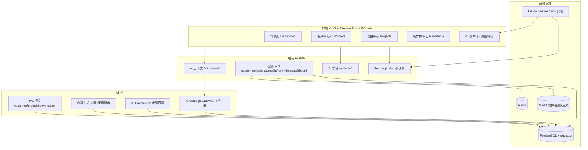

# 9-17 新增数据仪表盘需求实现计划（最终实施文档）

| 项目 | 内容 |
|---|---|
| 文档版本 | v2.0（合并两轮专家评审意见后的执行版） |
| 编制日期 | 2026-09-17 |
| 目标仓库 | `/home/AI-PIM/RiChangPIM`（WSL 发行版 RiChangPIM） |
| 需求来源 | 2026-09-16 需求截图（项目管理/客户管理/绑定销售数据/绑定设计图纸/驾驶舱/新媒体自动化） |
| 关联文档 | `docs/01-产品需求(PRD).md`、`docs/02-系统架构与设计(HLD).md`、`docs/03-数据库设计(ERD).md`、`docs/04-接口规范(OpenAPI).md`、`AI-Docs/05-安全权限与AI治理.md`、`AI-Docs/08-架构决策记录ADR.md`、`PROJECT_MANAGEMENT.md` |
| 交付方式 | 一次大版本连续开发；合并按阶段拆 PR（见 §14），发布前全部通过门禁 |

> 本版在初版方案基础上，采纳两位专家评审的全部关键意见：新增 `project_context`（项目 AI 上下文）、`/ai/context/*` 业务上下文接口、`data_scope` 数据权限模型、`TaskScheduler` 调度抽象、曝光采集插件化设计；并补入开工前决策确认、分阶段合并策略、运营预期与技术债说明。

---

## 1. 需求背景与范围

### 1.1 原始需求（2026-09-16 截图）

1. **项目管理 + 客户管理 + 绑定销售、数据 + 绑定设计、图纸**；销售数据包含客户对话、需求、客资、方案、跟进记录等；
2. **驾驶舱显示数据**（上述业务数据汇总展示）；
3. **新媒体方面**：自动生成多条文案、视频脚本，可标记是否采纳；后续 agent 定时提醒跟进已采纳文案制成视频的曝光数据，然后汇总到驾驶舱（仪表盘）。

### 1.2 追加要求

- 所有新增功能均需实现 AI 介入，**全部预留 AI 可读写字段/接口**。

### 1.3 已确认决策基线

| 决策点 | 结论 |
|---|---|
| 实施仓库 | `/home/AI-PIM/RiChangPIM`（开工前先提交其 3 处未提交改动，避免混入） |
| 交付节奏 | 一次性全部实现，但按阶段拆分 PR 合并（专家意见①） |
| 客户对话来源 | 先手工录入/粘贴 + AI 摘要；预留 `source_type=asr`、`audio_file_id`、`transcript_status` 字段给后续转写功能 |
| 曝光数据采集 | 手工录入 + 系统内提醒；预留采集插件接口，未来接平台 API 不推翻模型 |
| 设计图纸范围 | 文件挂接 + 分类（效果图/施工图/平面图/其他）+ 版本（复用 MinIO 附件体系） |
| AI 写入策略 | 增强直写（AI 只写 `ai_*` 字段）+ 业务变更人工确认（PendingAction） |
| 客户数据与 AI | 客户信息仅内部人员可见，按正常内部数据参与 AI 检索与生成，受 RBAC + 数据权限双重约束（ADR-014 需正式修订，见 §4.2） |
| 数据范围 | 新增团队与数据权限（USER/TEAM/DEPARTMENT/ALL），销售看自己、主管看团队、老板看全部（专家意见①） |

---

## 2. 现状与差距

### 2.1 现有能力（已核实）

| 能力 | 现状 | 关键位置 |
|---|---|---|
| 技术栈 | FastAPI + async SQLAlchemy + PG16(pgvector) + Redis + MinIO；Vue3 + Element Plus + Pinia | `backend/app/main.py`、`frontend/package.json` |
| 数据模型基类 | UUID 主键、软删、时间戳 | `backend/app/models/base.py`（CommonBase） |
| RBAC | 权限码 + 角色，权限由迁移种子写入；`PermissionChecker` 依赖注入 | `backend/app/core/permission.py`、`alembic/versions/0011_*`、`0013_*` |
| 审计 | `AuditMiddleware` + `@audit_action`，敏感模块 body 脱敏 | `backend/app/middleware/audit.py` |
| AI 适配器 | OpenAI-compatible `chat/chat_stream/embed`；严格 JSON + Pydantic 校验范式 | `backend/app/adapters/*`、`backend/app/services/polish.py` |
| 知识网关 | 只读工具注册表、字段投影、权限池、RAG 文档索引 | `backend/app/knowledge/tools/registry.py`、`field_projection.py`、`documents/base.py` |
| PendingAction | AI 提议 → 人工确认 → 落库；幂等键 + 乐观锁 + 过期 | `backend/app/models/ai_action.py`、`services/pending_actions.py` |
| 定时任务 | 系统 cron 调脚本（无调度框架） | `backend/app/scripts/share_token_cron.py`、`scripts/ai-pim-backup.cron` |
| 销售域 | Proposal / Quotation，客户仅 `customer_name` 字符串 | `backend/app/models/sales.py:15` |
| 统计 | 仅分享统计 + 热门产品 | `backend/app/api/v1/stats.py` |
| 迁移版本 | 至 `0017_operation_log_username` | `backend/alembic/versions/` |

### 2.2 差距（全部为新增）

- 无客户/联系人/对话/需求/客资/跟进模型；
- 无项目、项目上下文、阶段流转；
- 无设计方案与图纸管理；
- 无新媒体（文案/脚本生成、采纳、成片、曝光）；
- 无提醒/待办；
- 无驾驶舱与图表能力（前端无 echarts）；
- 无数据权限（团队/数据范围）模型；
- 无业务上下文聚合接口（Agent 需自己拼数据）；
- `ToolRegistry` 目前硬拒绝写工具（`knowledge/tools/registry.py:29`）；
- `pending_action` 的 CheckConstraint 仅允许 proposal 两种类型（`models/ai_action.py:31`）。

---

## 3. 总体架构



### 3.1 设计原则

1. **严格复用既有模式**：`CommonBase`、`PermissionChecker` + `@audit_action`、迁移内权限种子、`polish.py` 严格 JSON 校验、MinIO 附件、`share_log` 复用。
2. **AI 优先但不越权**：所有新实体自带 AI 字段；AI 直写仅限 `ai_*` 增强数据，业务变更必须经 PendingAction 人工确认。
3. **数据先于看板**：驾驶舱最后做，依赖前序业务数据与聚合接口（顺序同专家建议）。
4. **调度可迁移**：提醒逻辑与调度实现解耦（TaskScheduler 抽象），当前 cron、未来队列，不改业务代码。
5. **采集可扩展**：曝光数据设计为「发布记录 → 采集插件 → 人工补录兜底」，未来接平台 API 不改模型。
6. **权限双轨**：功能权限（RBAC）+ 数据权限（data_scope），AI 读写同样受两者约束。

### 3.2 关键决策摘要

| 决策 | 结论 |
|---|---|
| AI 字段 | 统一 `AIFieldsMixin` + 通用 `ai_field`/`ai_field_change` |
| AI 写入 | 两档：增强直写（suggested 待复核）/ 业务变更（PendingAction 确认） |
| 数据权限 | `team` 树 + `user.team_id` + `role.data_scope(USER/TEAM/DEPARTMENT/ALL)` |
| 调度 | `TaskScheduler` 协议 + `CronTaskScheduler` 实现 + `task_run` 运行记录 |
| 曝光采集 | `MetricProvider` 插件协议 + 人工录入 + 定时提醒兜底 |
| 项目上下文 | `project.context JSONB` 结构化字段，供 AI 生成方案/文案使用 |

---

## 4. 开工前决策确认清单（阻断项）

> 专家意见②：范围扩张与隐私决策需**开工前取得正式确认**，不能只做事后文档同步。以下 4 项完成后方可进入阶段 0 开发。

### 4.1 PRD 边界修订（必须）

- 原 PRD 明确「不属于 CRM」「不做多级客户生命周期管理」（`docs/00-项目概述.md`、`docs/02-系统架构与设计(HLD).md`）；原路线图将「数据驾驶舱」排 V3、「AI 营销文案/短视频脚本」排 V2。
- 本次需求等于**提前并扩界**。需修订：
  - `docs/01-产品需求(PRD).md`：模块清单、角色权限矩阵、阶段矩阵（V2 提前、V3 驾驶舱提前）；
  - `docs/00-项目概述.md`、`docs/02-系统架构与设计(HLD).md`：系统边界描述；
  - `PROJECT_MANAGEMENT.md`：V2/V3 计划调整。
- **确认人：产品负责人 / 业务负责人；确认方式：文档评审通过并记录在 CHANGELOG。**

### 4.2 ADR-014 正式修订（必须）

- `AI-Docs/08-架构决策记录ADR.md` ADR-014 要求「成本与客户敏感数据不得外发模型」；本次决策为「客户信息按内部数据正常处理」。
- 需新增/修订 ADR（如 ADR-015「客户域数据与 AI 读写治理」），明确：
  - 客户数据可参与 AI 摘要/生成/检索的范围；
  - 仍禁止外发模型的数据：成本价、供应商敏感字段（维持原状）；
  - 外部模型 vs 内网模型的差异策略（推荐：外部模型默认脱敏电话/微信，内网模型可全量）；
  - 数据权限与字段投影的执行点。
- **确认人：架构负责人 / 业务负责人；产出：ADR 修订记录。**

### 4.3 合并与发布策略确认

- 一次开发、**分 6~7 个 PR 顺序合并**（见 §14），每个 PR 独立通过 CI 门禁；
- 开发期新功能仅授予 admin 权限，发布时再开放给 sales 等角色（利用 RBAC 灰度，无需 feature flag 框架）。

### 4.4 运营与组织确认

- 曝光数据录入责任人、频率、截止规则（超期几天提醒）；
- 团队/主管组织模型由谁维护（`team` 树的数据来源）；
- 版本号与发布时间窗（建议随 v2.0.0 发布，见 §14.3）。

---

## 5. 数据模型设计

### 5.1 AI 基座（所有新表共用）

**`AIFieldsMixin`**（`backend/app/models/ai_fields.py`，SQLAlchemy Mixin，随各域迁移落到每张新表）：

| 字段 | 类型 | 说明 |
|---|---|---|
| ai_summary | TEXT NULL | AI 摘要/结论（可读可写） |
| ai_tags | JSONB DEFAULT '[]' | AI 标签（可检索） |
| ai_extract | JSONB DEFAULT '{}' | AI 结构化提取（需求/预算/时间点等） |
| ai_source_ids | JSONB DEFAULT '[]' | 引用来源（对话/文件/产品 ID） |
| ai_meta | JSONB DEFAULT '{}' | `{provider, model, version, confidence, generated_at, prompt_version}` |
| ai_status | VARCHAR(20) DEFAULT 'none' | `none / suggested / accepted / rejected`（人工复核状态） |
| ai_confirmed_by | UUID FK user NULL | AI 字段采纳人 |
| ai_confirmed_at | TIMESTAMPTZ NULL | 采纳时间 |

需要语义检索的表（customer、customer_conversation、customer_requirement、project）另加：

| 字段 | 类型 | 说明 |
|---|---|---|
| ai_embedding | VECTOR(2048) | 与 `product.vector` 同规格，供 RAG 检索 |

**通用扩展表 `ai_field`**（任意实体挂任意 AI 字段，避免频繁改表）：

```
ai_field
├─ id UUID PK / CommonBase
├─ resource_type VARCHAR(32)      -- customer / project / conversation / media_content ...
├─ resource_id UUID
├─ field_key VARCHAR(64)
├─ value JSONB
├─ value_type VARCHAR(20)         -- text / number / date / list / object
├─ origin VARCHAR(10)             -- ai / human
├─ review_status VARCHAR(20)      -- suggested / accepted / rejected
├─ model_provider VARCHAR(64) / model_name VARCHAR(128)
├─ confidence FLOAT NULL
├─ source_ids JSONB DEFAULT '[]'
├─ created_by UUID FK user NULL
├─ confirmed_by UUID FK user NULL / confirmed_at TIMESTAMPTZ NULL
└─ 部分唯一索引: (resource_type, resource_id, field_key) WHERE is_deleted=false
   （同一字段仅保留一条有效值；新建议写入时旧 suggested 置 rejected）
```

**变更历史表 `ai_field_change`**（AI/人工写 AI 字段的审计留痕）：

```
ai_field_change
├─ id UUID PK / CommonBase
├─ ai_field_id UUID FK ai_field NULL
├─ resource_type VARCHAR(32) / resource_id UUID / field_key VARCHAR(64)
├─ before_value JSONB / after_value JSONB
├─ origin VARCHAR(10) / actor_type VARCHAR(10)   -- ai / user
├─ actor_id UUID FK user NULL
├─ model_name VARCHAR(128) NULL
└─ create_time
```

### 5.2 数据权限模型（新增）

```
team
├─ id UUID PK / CommonBase
├─ name VARCHAR(64)
├─ leader_id UUID FK user NULL
├─ parent_id UUID FK team NULL          -- 支持部门树（DEPARTMENT 语义）
├─ sort INT DEFAULT 0
└─ remark VARCHAR(255)

user 扩展
└─ team_id UUID FK team NULL

role 扩展
└─ data_scope VARCHAR(20) DEFAULT 'USER'   -- USER / TEAM / DEPARTMENT / ALL
```

- **语义**：USER=仅本人（owner/creator）；TEAM=本人 + 同 team；DEPARTMENT=本 team 及子树；ALL=全部；admin 角色继续走现有旁路（全量）。
- **后端执行点**：新增 `backend/app/core/data_scope.py`
  - `resolve_data_scope(current_user) -> DataScope`（含 team 子树用户 ID 集合）；
  - `apply_scope(stmt, model, scope, owner_field="owner_id")` 统一注入过滤条件；
  - 应用到 customers / projects / followups / conversations / requirements / media / dashboard / 提醒列表的查询与导出。
- **AI 侧**：`ToolContext` / `PermissionPool` 携带 data_scope，知识工具与 `/ai/context/*`、RAG 检索同样过滤（RAG chunk metadata 写入 `owner_id/team_id`，检索期按 scope 过滤）。
- **默认值**：admin=ALL、sales=USER、purchaser=USER、viewer=USER；销售主管由管理员新建角色并配 TEAM。

### 5.3 客户域

```
customer（客资档案）
├─ CommonBase + AIFieldsMixin + ai_embedding
├─ customer_no VARCHAR(64) 唯一（部分唯一索引 WHERE is_deleted=false）
├─ name VARCHAR(128) / short_name VARCHAR(64)
├─ level VARCHAR(8)            -- A/B/C/D
├─ industry VARCHAR(64) / region VARCHAR(64)
├─ source VARCHAR(32)          -- referral/exhibition/online/outbound/partner/other（客资来源）
├─ status VARCHAR(20)          -- potential/following/signed/lost
├─ owner_id UUID FK user       -- 数据权限 owner 字段
├─ phone VARCHAR(32) / wechat VARCHAR(64) / address VARCHAR(255)
├─ next_follow_at TIMESTAMPTZ
└─ remark TEXT
索引：name、owner_id、status、next_follow_at

customer_contact（联系人）
├─ CommonBase + AIFieldsMixin
├─ customer_id UUID FK customer
├─ name / title / phone / wechat / email
├─ is_primary BOOL DEFAULT false
└─ remark

customer_conversation（客户对话）
├─ CommonBase + AIFieldsMixin + ai_embedding
├─ customer_id FK / project_id FK NULL
├─ channel VARCHAR(20)         -- wechat/phone/meeting/other
├─ happened_at TIMESTAMPTZ
├─ content TEXT                -- 粘贴原文
├─ source_type VARCHAR(16) DEFAULT 'manual'   -- manual / asr（预留转写）
├─ audio_file_id UUID FK attachment NULL      -- 预留转写
├─ transcript_status VARCHAR(20) NULL         -- pending/done/failed（预留）
└─ created_by UUID FK user

customer_requirement（需求）
├─ CommonBase + AIFieldsMixin + ai_embedding
├─ customer_id FK / project_id FK NULL
├─ title VARCHAR(255) / content TEXT
├─ priority VARCHAR(8)         -- high/medium/low
├─ status VARCHAR(20)          -- new/confirmed/planned/fulfilled/closed
├─ source VARCHAR(16)          -- manual/conversation/ai
├─ source_conversation_id FK customer_conversation NULL
├─ expected_date DATE NULL
└─ created_by

customer_followup（跟进记录）
├─ CommonBase + AIFieldsMixin
├─ customer_id FK / project_id FK NULL
├─ follow_type VARCHAR(20)     -- phone/visit/wechat/other
├─ content TEXT
├─ attachment_ids JSONB DEFAULT '[]'
├─ follow_time TIMESTAMPTZ / next_follow_at TIMESTAMPTZ NULL
└─ created_by
```

### 5.4 项目域（含 `project_context`）

```
project
├─ CommonBase + AIFieldsMixin + ai_embedding
├─ project_no VARCHAR(64) 唯一（部分唯一索引）
├─ name VARCHAR(255) / customer_id UUID FK customer
├─ owner_id UUID FK user（销售） / designer_id UUID FK user NULL
├─ stage VARCHAR(20)           -- lead/requirement/design/quote/contract/delivery/done/on_hold
├─ status VARCHAR(20)          -- active/paused/closed
├─ expected_amount / contract_amount NUMERIC(14,2)
├─ expected_close_date DATE NULL
├─ project_context JSONB DEFAULT '{}'     -- AI 上下文（专家意见①）
├─ context_version INT DEFAULT 1
├─ description TEXT
└─ created_by
索引：customer_id、owner_id、stage

project_stage_log（阶段流转，驱动漏斗/周期统计）
├─ CommonBase
├─ project_id FK / from_stage / to_stage
├─ changed_by FK user / changed_at / reason VARCHAR(255)
```

**`project_context` 结构约定**（结构化 JSON，AI 生成方案/文案的核心输入）：

```json
{
  "house_type": "三室两厅",
  "area_sqm": 120,
  "address": "……",
  "style": "现代简约",
  "budget": {"min": 300000, "max": 500000, "currency": "CNY"},
  "family_members": [{"role": "户主", "age": 35}],
  "material_preferences": ["原木", "岩板"],
  "competitors": [{"name": "竞品A", "quote": 420000, "note": "……"}],
  "key_dates": [{"name": "婚期", "date": "2027-05-01"}],
  "notes": "……"
}
```

- 人工通过结构化表单（`ProjectContextForm.vue`）维护；
- AI 通过 `ai_extract` 建议（suggested）→ 人工采纳后合并进 `project_context`（业务变更走 PendingAction `project.update_context`）；
- 字段变更按来源分别留痕：AI 走 `ai_field_change`，人工走操作审计。

### 5.5 销售包与方案绑定

- 销售包 = 对话（conversation）+ 需求（requirement）+ 客资（customer 档案/source）+ 方案（既有 proposal）+ 跟进（followup），全部通过 `customer_id` / `project_id` 关联。
- **`proposal` 扩展**（`models/sales.py`）：

```
proposal 追加
├─ customer_id UUID FK customer NULL（索引）
└─ project_id UUID FK project NULL（索引）
```

  - 保留 `customer_name` 兼容旧数据；新建/编辑时若选客户则自动回填 `customer_name`；
  - 可选一次性回填脚本 `scripts/backfill_customers.py`（按 distinct `customer_name` 建客户并挂接，默认不执行，需人工确认）；
  - `proposal` 已有 `ai_polish_content/ai_source_ids/ai_confirmed_by` 等字段，**不重复挂 AIFieldsMixin**。
- Quotation 通过 proposal 关联项目/客户，报表聚合走 join。

### 5.6 设计与图纸

```
project_design（设计方案，含版本）
├─ CommonBase + AIFieldsMixin
├─ project_id FK / name VARCHAR(255) / version VARCHAR(32)
├─ designer_id FK user NULL
├─ status VARCHAR(20)          -- drafting/reviewing/confirmed/rejected
├─ description TEXT
└─ created_by

design_file（图纸/设计文件）
├─ CommonBase + AIFieldsMixin
├─ design_id FK project_design
├─ attachment_id UUID FK attachment     -- 复用 MinIO 附件
├─ file_category VARCHAR(20)            -- effect/construction/floorplan/other
├─ version VARCHAR(32) NULL             -- 文件级版本（与方案版本并存）
├─ sort INT DEFAULT 0 / remark
└─ uploaded_by FK user
```

- 上传沿用 `MediaUploader` / `/api/v1/files` 体系；`api/v1/files.py` 白名单按实际需求补 DWG 等类型（浏览器 MIME 不稳定，按扩展名兜底），体积上限沿用/调整需在阶段 2 评审（当前：图片/PDF 50MB、MP4 100MB）。
- 图纸绑定项目：`project_design.project_id`；版本关系：方案版本 + 文件版本双层。

### 5.7 新媒体域

```
media_generation（生成批次）
├─ CommonBase + AIFieldsMixin
├─ topic VARCHAR(255)
├─ platform VARCHAR(32)        -- xiaohongshu/moments/douyin/video_account/seo/general
├─ content_types JSONB         -- ["copywriting","video_script"]
├─ item_count INT
├─ product_ids JSONB / customer_id FK NULL / project_id FK NULL
├─ model_provider / model_name / prompt_version VARCHAR(32)
├─ status VARCHAR(20)          -- pending/success/failed
├─ error TEXT NULL
└─ created_by

media_content（文案 / 视频脚本）
├─ CommonBase + AIFieldsMixin
├─ generation_id FK media_generation
├─ content_type VARCHAR(20)    -- copywriting / video_script
├─ platform VARCHAR(32) / title VARCHAR(255) / body TEXT
├─ status VARCHAR(20)          -- draft/adopted/rejected
├─ adopted_by FK user NULL / adopted_at TIMESTAMPTZ NULL
├─ reject_reason VARCHAR(255) NULL
└─ created_by

media_publication（成片/发布记录）
├─ CommonBase + AIFieldsMixin
├─ content_id FK media_content
├─ platform VARCHAR(32)
├─ video_url VARCHAR(500) NULL / video_file_id UUID FK attachment NULL
├─ published_at DATE
├─ status VARCHAR(20)          -- published/removed
├─ remark
└─ created_by

media_metric（曝光数据，按日）
├─ CommonBase + AIFieldsMixin
├─ publication_id FK media_publication
├─ stat_date DATE
├─ exposure_count / view_count BIGINT DEFAULT 0
├─ like_count / comment_count / share_count / favorite_count / follower_gain INT DEFAULT 0
├─ source VARCHAR(16) DEFAULT 'manual'    -- manual/import/api（采集插件写入）
├─ recorded_by FK user NULL
└─ 部分唯一索引: (publication_id, stat_date) WHERE is_deleted=false
```

### 5.8 提醒与任务运行

```
reminder（系统内待办）
├─ CommonBase + AIFieldsMixin
├─ biz_type VARCHAR(32)        -- media_publish/media_metric/customer_followup/project_stage
├─ biz_id UUID
├─ title VARCHAR(255) / content TEXT
├─ due_at TIMESTAMPTZ / assignee_id FK user
├─ status VARCHAR(20)          -- pending/done/dismissed
├─ done_at / done_by FK user NULL
├─ channel VARCHAR(16) DEFAULT 'in_app'    -- 预留 wecom/email
├─ extra JSONB DEFAULT '{}'
└─ 部分唯一索引: (biz_type, biz_id) WHERE status='pending' AND is_deleted=false（幂等）

task_run（定时任务运行记录，专家意见①）
├─ CommonBase
├─ task_name VARCHAR(64) / scheduled_at TIMESTAMPTZ
├─ started_at / finished_at TIMESTAMPTZ NULL
├─ status VARCHAR(20)          -- running/success/failed/skipped
├─ stats JSONB DEFAULT '{}' / error TEXT NULL
└─ lock_key VARCHAR(64)        -- PG advisory lock 键
```

### 5.9 迁移清单（权限种子折入对应迁移，沿用 0011/0013 写法）

| 迁移 | 内容 |
|---|---|
| `0018_ai_base_and_data_scope` | `ai_field`、`ai_field_change`、`task_run`、`team` + `user.team_id` + `role.data_scope`；放宽 `pending_action.action_type` CheckConstraint；AI/数据权限基础种子 |
| `0019_add_customer_crm` | customer、contact、conversation、requirement、followup + customer 域权限种子 |
| `0020_add_project_tables` | project、project_stage_log、project_design、design_file、`proposal.customer_id/project_id` + project 域权限种子 |
| `0021_add_new_media` | media_generation/content/publication/metric + media 域权限种子 |
| `0022_add_reminders` | reminder + reminder/dashboard 权限种子 |

全部迁移必须可 `upgrade` / `downgrade`；对既有表仅做**可空追加**（proposal 两个 FK），保证回滚安全。

---

## 6. AI 读写接口设计

### 6.1 读：Knowledge Gateway 工具注册

在 `default_tool_registry()`（`knowledge/tools/registry.py:89`）新增只读工具，全部 `field_projection=True`、带 `required_permissions` 与 `risk_level`，并在 `ToolContext` 中携带 data_scope：

| 工具 | 说明 | 所需权限 |
|---|---|---|
| `customer.search` | 按名称/状态/等级/负责人检索（scope 过滤） | `customer:view` |
| `customer.get` | 客户档案 + 联系人 | `customer:view` |
| `customer.context` | 客户业务上下文（见 6.2） | `customer:view` + `ai:use` |
| `project.search` / `project.get` | 项目检索 / 详情 | `project:view` |
| `project.context` | 项目业务上下文（见 6.2） | `project:view` + `ai:use` |
| `followup.list` / `requirement.list` / `conversation.list` | 销售包列表 | 对应 `*:view` |
| `media.content.list` / `media.metrics.summary` | 新媒体内容与指标 | `media_content:view` |
| `dashboard.overview` | 驾驶舱聚合（scope 过滤） | `dashboard:view` |
| `reminder.list` | 待办列表 | `reminder:view` |

### 6.2 读：业务上下文接口 `/ai/context/*`（专家意见①）

解决「Agent 需要客户画像 + 历史沟通 + 报价 + 方案 + 跟进 + 竞品」的拼装问题：

```
GET /api/v1/ai/context/customer/{customer_id}
→ data: {
    customer: {...投影后档案 + ai 块},
    contacts: [],
    projects: [{id, name, stage, expected_amount, contract_amount, context}],
    requirements: [],
    conversations: [{id, channel, happened_at, ai_summary, content_excerpt}],
    followups: [],
    proposals: [{id, proposal_no, proposal_name, status, total_face_value, ai_polish_content}],
    quotations: [],
    reminders: [],
    media: [{id, type, status, publications, metrics}],
    ai: {summary, tags, extract, status},
    meta: {as_of, sections_truncated}
  }

GET /api/v1/ai/context/project/{project_id}
→ data: {
    project: {... + project_context},
    customer: {...},
    stage_logs: [],
    designs: [{id, name, version, status, files: []}],
    proposals: [], quotations: [],
    media: [], followups: [], requirements: [], reminders: [],
    ai: {...}, meta: {...}
  }
```

- 权限：`ai:use` + 对应资源 `*:view` + data_scope（越权返回 403/空集）；
- 字段投影：复用 `knowledge/field_projection.py` 与 `PermissionPool.hidden_fields`；
- 分节限量（如最近 20 条对话/跟进）+ `meta` 标记截断，防止上下文爆炸；
- 同时注册为只读工具（`customer.context` / `project.context`），供 Portal AI 对话调用。

### 6.3 读：RAG 知识索引

- 新增文档提供者：`knowledge/documents/customer.py`、`project.py`、`conversation.py`，走 `KnowledgeDocumentUpserter`；
- 文档 `required_permission` 分别为 `customer:view` / `project:view`，`visibility='internal'`；
- chunk `metadata_json` 写入 `owner_id` / `team_id`，检索期在 `knowledge/retrieval/filters.py` 增加 data_scope 过滤（否则会跨销售泄露数据）；
- 索引触发：新建/更新后经 `knowledge/jobs` dispatcher 入队，复用 worker 异步索引；
- 客户信息按内部数据正常处理（已确认），但仍沿用字段投影剔除角色隐藏字段。

### 6.4 字段投影与数据权限

- `PermissionPool.hidden_fields` 扩展支持新实体字段（如成本类字段对 sales 隐藏）；
- `knowledge/permission_pool.py` 增加 data_scope 上下文；
- 所有 AI 读路径（工具、context、RAG）统一经过「RBAC 字段投影 + data_scope 行过滤」两道闸。

### 6.5 写：AI 增强直写

`backend/app/services/ai_enrichment.py`：

- 支持类型：`customer.profile`（客户画像摘要/标签）、`conversation.summarize`（对话摘要 + 需求提取）、`requirement.extract`、`project.context_suggest`、`design_file.describe`、`media.metric_summarize`；
- 实现范式同 `services/polish.py`：严格 JSON 提示词 → `_extract_json` → Pydantic 校验 → 失败不落库；
- 写入目标：实体 `ai_summary/ai_tags/ai_extract` 或 `ai_field`，`ai_status='suggested'`，`ai_meta` 记录模型信息，`ai_field_change` 留痕；
- AI 未配置（NoneAdapter）时返回受控 503，语义同现有 `AI_ADAPTER=none`；
- API：`POST /api/v1/ai/enrich/{resource_type}/{resource_id}`。

### 6.6 写：PendingAction 业务确认流

- **放宽约束**（`models/ai_action.py:31`，迁移 0018）：新增 action_type：
  `customer.create`、`customer.update`、`customer_followup.create`、`customer_requirement.create`、`project.create`、`project.update_stage`、`project.update_context`、`project_design.create`、`design_file.attach`、`proposal.bind_customer_project`、`media_content.adopt`、`media_content.reject`、`media_publication.create`、`media_metric.record`、`reminder.complete`；
- **重构分发**：`services/pending_actions.py:100` 的 if/elif 改为 handler 注册表 `PENDING_ACTION_HANDLERS: dict[str, Handler]`，每个 handler：
  - 用 `schemas/pending_action.py` 新增的 Pydantic payload 校验；
  - 带 `expected_update_time` 乐观锁（沿用现有冲突语义）；
  - 写库后回填 `result`，`source_ids/model_name/generation_version` 留痕；
  - 幂等键：`{action_type}:{target_id}:{payload_hash}`。
- **状态机**保持：pending → confirmed / cancelled / expired / conflict。

### 6.7 写：WriteToolRegistry

- `knowledge/tools/registry.py:29` 现硬拒绝写工具，拆分为：
  - `ToolRegistry`（只读，现状不变）；
  - `WriteToolRegistry`：注册 `*_suggestion` 类工具（如 `followup.create_suggestion`、`media_metric.record_suggestion`）；
  - **写入硬约束**：写工具只能 (a) 生成 PendingAction 或 (b) 写 `ai_*` 增强字段；禁止直接改业务列（单测断言写工具不直接调用业务 ORM 写入）。
- `knowledge/policy.py` 扩展写授权（risk_level + 权限码 + `ai:use`）；
- 写工具事件全部 `audit_event` 落审计。

### 6.8 统一 AI 字段契约 API

```
GET  /api/v1/ai/fields/{resource_type}/{resource_id}     # AI 字段列表（值 + 来源 + 复核状态）
POST /api/v1/ai/fields/{resource_type}/{resource_id}     # 写入 AI 字段（origin=ai/human，带 model/confidence/source_ids）
POST /api/v1/ai/fields/{field_id}/accept                 # 人工采纳（ai_status → accepted）
POST /api/v1/ai/fields/{field_id}/reject                 # 人工驳回（→ rejected）
GET  /api/v1/ai/readable/{resource_type}                 # 该资源 AI 可读字段 schema（按权限过滤）
```

- resource_type 白名单在 `schemas/ai_fields.py` 注册；
- 所有新资源在 OpenAPI（`docs/04-接口规范(OpenAPI).md`）同步文档化。

---

## 7. 后端实施清单（文件级）

### 7.1 模型（`backend/app/models/`）

| 文件 | 内容 |
|---|---|
| `ai_fields.py`（新） | `AIFieldsMixin` |
| `customer.py`（新） | Customer / CustomerContact / CustomerConversation / CustomerRequirement / CustomerFollowup |
| `project.py`（新） | Project / ProjectStageLog / ProjectDesign / DesignFile |
| `media_content.py`（新） | MediaGeneration / MediaContent / MediaPublication / MediaMetric |
| `reminder.py`（新） | Reminder / TaskRun |
| `team.py`（新，或并入 user.py） | Team |
| `sales.py`（改） | Proposal 加 customer_id / project_id |
| `user.py`（改） | User.team_id、Role.data_scope |
| `ai_action.py`（改） | CheckConstraint 放宽 |
| `__init__.py`（改） | 注册全部新模型 |

### 7.2 核心与服务

| 文件 | 内容 |
|---|---|
| `core/data_scope.py`（新） | DataScope 解析与 SQLAlchemy 过滤注入 |
| `knowledge/permission_pool.py`（改） | hidden_fields 扩展 + data_scope 上下文 |
| `knowledge/tools/customer.py`、`project.py`、`media.py`（新） | 只读工具 |
| `knowledge/documents/customer.py`、`project.py`、`conversation.py`（新） | RAG 文档提供者 |
| `knowledge/tools/registry.py`（改） | `WriteToolRegistry` 拆分 + 新工具注册 |
| `knowledge/policy.py`（改） | 写工具授权 |
| `knowledge/retrieval/filters.py`（改） | data_scope 检索过滤 |
| `services/ai_enrichment.py`（新） | 增强直写 |
| `services/content_generation.py`（新） | 批量文案/视频脚本生成（严格 JSON + Pydantic） |
| `services/dashboard.py`（新） | 驾驶舱聚合（scope 过滤） |
| `services/reminders.py`（新） | 提醒扫描与幂等写入 |
| `services/scheduler/base.py`、`cron.py`、`tasks.py`（新） | TaskScheduler 抽象 + Cron 实现 + 任务注册 |
| `services/media_metrics/base.py`、`registry.py`（新） | 曝光采集插件协议 + 注册表（manual 默认） |
| `services/pending_actions.py`（改） | handler 注册表 + 15 种新 action |
| `middleware/audit.py`（改） | 新敏感模块（客户对话等）body 脱敏 |
| `api/v1/files.py`（改） | 按需补 DWG 等类型/体积 |

### 7.3 API 路由（`backend/app/api/v1/`）

| 文件 | 端点前缀 |
|---|---|
| `customers.py`（新） | `/api/v1/customers`（含 contacts / conversations / requirements / followups 子资源） |
| `projects.py`（新） | `/api/v1/projects`（含 designs / files / stage-log / context） |
| `media.py`（新） | `/api/v1/media`（generations / contents / publications / metrics） |
| `reminders.py`（新） | `/api/v1/reminders` |
| `dashboard.py`（新） | `/api/v1/dashboard` |
| `ai_context.py`（新） | `/api/v1/ai/context/*` |
| `ai_fields.py`（新） | `/api/v1/ai/fields/*`、`/ai/readable/*` |
| `teams.py`（新） | `/api/v1/teams` |
| `__init__.py`、`main.py`（改） | 注册全部新 router（照 `main.py:191` 模式） |

### 7.4 Schema / 脚本 / 测试

- `schemas/`：`customer.py`、`project.py`、`media_content.py`、`reminder.py`、`dashboard.py`、`ai_fields.py`、`ai_context.py`（新）；`user.py`（data_scope/team）、`pending_action.py`（新 action payload）改。
- `app/scripts/`：`scheduler_cron.py`（CLI：`python -m app.scripts.scheduler_cron <task_name>`）、`backfill_customers.py`（可选回填）。
- `tests/`：`test_customers.py`、`test_projects.py`、`test_media.py`、`test_reminders.py`、`test_dashboard.py`、`test_data_scope.py`、`test_ai_context.py`、`test_ai_fields.py`、`test_scheduler.py`、`test_pending_actions_ext.py`。

---

## 8. 前端实施清单（文件级）

### 8.1 新依赖与页面

- 依赖新增：`echarts`（驾驶舱图表）。
- 页面（`frontend/src/views/`）：
  - `Dashboard.vue` — 驾驶舱（卡片 + 漏斗 + 趋势 + 平台分布 + Top 内容 + 待办）
  - `Customers.vue` / `CustomerDetail.vue` — Tab：档案 / 联系人 / 对话 / 需求 / 跟进 / 关联项目
  - `Projects.vue` / `ProjectDetail.vue` — Tab：概览 / 销售数据（对话·需求·跟进）/ 方案报价 / 设计方案与图纸 / 新媒体
  - `NewMedia.vue` / `NewMediaDetail.vue` — 生成批次、勾选采纳/驳回、成片登记、曝光录入
  - `AiInbox.vue` — AI 待确认动作收件箱（复用 `/pending-actions` API）
  - `Teams.vue` — 团队管理（admin）

### 8.2 组件与改造

- 组件（`frontend/src/components/`）：`CustomerSelect.vue`、`ProjectSelect.vue`（远程搜索）、`DesignFileUploader.vue`（分类 + 版本）、`AiSuggestionCard.vue`（AI 建议采纳/编辑/驳回 + 来源徽章）、`ReminderBell.vue`、`ProjectContextForm.vue`、`ContextDrawer.vue`（AI 上下文查看）。
- 改造：
  - `api/index.ts`：新增 `customerApi/projectApi/mediaApi/reminderApi/dashboardApi/aiFieldApi/aiContextApi/teamApi`；
  - `types/`：新增 `customer.ts/project.ts/media.ts/reminder.ts/dashboard.ts/team.ts`；扩展 `permissions.ts`；
  - `router.ts` + `layouts/MainLayout.vue`：新增菜单分组「客户中心」「项目中心」「新媒体」「驾驶舱」「AI 收件箱」，更新 `subMenuMap`/`routeLabels`；
  - `views/Proposals.vue`、`ProposalDetail.vue`：创建/编辑时绑定客户与项目；
  - `views/Roles.vue`：data_scope 选择；`views/Users.vue`：team 选择。

### 8.3 前端测试

- Vitest：`Customers.spec.ts`、`Projects.spec.ts`、`NewMedia.spec.ts`、`Dashboard.spec.ts`、`AiSuggestionCard.spec.ts`、`ProjectContextForm.spec.ts`。
- Playwright e2e：`crm-flow.spec.ts`（客户→项目→需求/对话/跟进→绑定方案→图纸上传）、`new-media-flow.spec.ts`（生成→采纳→成片→曝光→驾驶舱出现数据）、`data-scope.spec.ts`（销售 A 不可见销售 B 数据）、`ai-pending.spec.ts`（AI 提议→人工确认落库）。

---

## 9. 权限矩阵与菜单

### 9.1 新增权限码（折入各域迁移种子）

| 域 | 权限码 |
|---|---|
| 客户 | `customer:view/create/edit/delete`、`customer_contact:manage`、`customer_conversation:view/create/summarize`、`customer_requirement:view/create/edit`、`customer_followup:view/create` |
| 项目 | `project:view/create/edit/delete`、`project_context:edit`、`project_design:view/create/edit`、`design_file:view/upload/delete` |
| 驾驶舱 | `dashboard:view` |
| 新媒体 | `media:generate`、`media_content:view/adopt/delete`、`media_publication:manage`、`media_metric:record` |
| 提醒 | `reminder:view/handle` |
| 团队 | `team:manage`（admin） |

### 9.2 角色默认映射与数据范围

| 角色 | 新增权限 | data_scope |
|---|---|---|
| admin | 全部 | ALL |
| sales | 客户端全量（view/create/edit + contact + conversation + requirement + followup）、project view/create/edit + context + design + design_file view/upload、dashboard:view、media:generate + content view/adopt + publication manage + metric record、reminder view/handle | USER |
| purchaser | 默认不授予（按需在角色页调整） | USER |
| viewer | 默认不授予（建议仅 `dashboard:view` 由管理员按需加） | USER |
| 销售主管（新建角色示例） | 同 sales + `customer:delete`、`project:delete` | TEAM |

---

## 10. 驾驶舱指标定义

`GET /api/v1/dashboard/overview?range=7d|30d|90d|custom`，全部聚合按当前用户 data_scope 过滤：

| 分组 | 指标 |
|---|---|
| 客户 | 客户总数、区间新增、状态分布、来源（客资）分布、新增趋势 |
| 项目 | 阶段漏斗（数量 + 金额）、签约金额、赢单率、平均成交周期（stage_log）、停滞项目（超 N 天无跟进） |
| 销售 | 跟进次数、逾期未跟进、未关闭需求数、方案数/金额趋势、报价确认金额 |
| 设计 | 设计方案数、待确认数、图纸文件数 |
| 新媒体 | 生成量、采纳数/采纳率、成片数、曝光/播放/点赞/评论/转发总量与趋势、平台分布、Top 内容、互动率 |
| 待办 | 未完成提醒（按类型/负责人/逾期） |
| 分享（复用） | 分享数、访问次数、Top 访问（既有 `stats.py`） |

前端 `Dashboard.vue` 用 echarts 渲染；admin/主管视图含全员对比，销售仅本人数据（由 data_scope 自动生效）。

---

## 11. 定时任务与曝光采集

### 11.1 TaskScheduler 抽象（专家意见①）

```
backend/app/services/scheduler/
├─ base.py     # TaskSpec(name, handler, description)、TaskScheduler Protocol
├─ cron.py     # CronTaskScheduler：PG advisory lock（pg_try_advisory_lock）
│              #   + task_run 记录（running/success/failed/skipped）+ 异常兜底
└─ tasks.py    # 任务注册：reminder_scan、media_metrics_sync（默认禁用）、knowledge_reindex（可选）

入口：backend/app/scripts/scheduler_cron.py <task_name>
crontab 示例（沿用 scripts/ai-pim-backup.cron 模式）：
  0 * * * * venv/bin/python -m app.scripts.scheduler_cron reminder_scan >> logs/scheduler.log 2>&1
```

- 现有 `share_token_cron.py` 保持不动，新任务全部走统一入口；
- 未来任务量上来自换 `RedisQueueScheduler`（实现同一 Protocol），业务代码零改动（技术债可控，专家意见①/②）。

### 11.2 提醒规则（`services/reminders.py`）

| 规则 | 触发 | biz_type |
|---|---|---|
| 已采纳文案超 N 天未登记成片 | 每日扫描 | `media_publish` |
| 成片超 M 天无曝光数据 | 每日扫描 | `media_metric` |
| 客户 `next_follow_at` 到期 | 每日扫描 | `customer_followup` |
| 项目阶段停滞（超 N 天无跟进/无流转） | 每日扫描 | `project_stage` |

- 幂等：`reminder` 部分唯一索引（pending 唯一）；
- 展示：驾驶舱「待办」区 + 顶栏 `ReminderBell`；
- 提醒完成后置 `done`，可手动 `dismissed`。

### 11.3 曝光采集插件（专家意见①）

```
services/media_metrics/base.py
├─ MetricSnapshot dataclass（stat_date + 各指标）
└─ MetricProvider Protocol: async fetch(publication, since) -> list[MetricSnapshot]
services/media_metrics/registry.py
└─ register_metric_provider(name, provider)；默认 manual（返回空，靠人工录入 + 提醒兜底）

链路：发布记录 → 采集插件（未来：抖音/小红书/视频号 API） → 人工补录兜底
```

- 指标写入 `source` 字段区分 `manual / import / api`；
- 定时任务 `media_metrics_sync` 先尝试 provider，未配置或失败则跳过，由 `reminder_scan` 生成补录提醒；
- 未来接平台 API 时只新增 provider 实现 + 配置，不改数据模型与前端。
- **运营预期**：平台无开放 API 前，曝光数据准确率依赖人工录入执行力，提前向运营交底。

---

## 12. 实施顺序（阶段 0–5，专家意见①调整后）

| 阶段 | 内容 | 交付物 |
|---|---|---|
| 阶段 0 | AI 数据基座 + 数据权限 | 迁移 0018（ai_field/ai_field_change/task_run/team/data_scope/pending_action 放宽）、`core/data_scope.py`、TaskScheduler 骨架、AI 字段契约 API、相关测试 |
| 阶段 1 | 客户 + 项目 + 销售包 | 迁移 0019/0020、客户/项目 API（含对话/需求/客资/跟进/项目上下文/stage_log）、方案绑定、前端客户/项目页 |
| 阶段 2 | 方案 / 图纸 | project_design + design_file + 上传（分类+版本）、`ProposalDetail` 绑定展示、图纸预览打通 |
| 阶段 3 | AI 助手 | `/ai/context/*`、enrichment、只读工具注册、RAG 索引（含 scope 过滤）、AI 收件箱与 AI 建议卡（写确认流） |
| 阶段 4 | 新媒体自动化 | 迁移 0021/0022、生成/采纳/成片/曝光 API 与页面、提醒引擎 + cron、采集插件骨架 |
| 阶段 5 | 驾驶舱 | `dashboard.py` 聚合 + `Dashboard.vue`（echarts）+ 铃铛/待办接入 + 分享统计并入 |

> 注：各业务阶段自带本域 AI 字段与所需 PendingAction 类型；阶段 3 是 AI 体验层的集中交付，避免把 AI 能力全部堆到最后。

---

## 13. 测试与验收

### 13.1 门禁（每阶段必须通过）

- 后端：`ruff` + `compileall` + `pytest`（非集成 + 集成）；
- 前端：`vue-tsc` + `eslint` + `vitest` + `vite build`；
- 迁移：`alembic upgrade head` + 逐迁移 `downgrade -1`（隔离库演练）；
- Compose 校验与 `pip-audit` / `npm audit`（沿用现有 CI）。

### 13.2 关键测试点

- 数据权限矩阵：USER/TEAM/DEPARTMENT/ALL × 各列表/详情/AI 工具/驾驶舱；
- PendingAction：幂等键、乐观锁冲突、过期、15 种新类型 handler；
- AI enrichment：严格 Schema 失败不落库、`suggested` 状态、AI 未配置时 503；
- `/ai/context/*`：字段投影、分节截断、越权 403；
- RAG：scope 过滤（销售 A 检索不到 B 的客户文档）；
- reminder：唯一索引幂等、完成/忽略状态流转；
- media_metric：按日 upsert 唯一约束；
- scheduler：advisory lock 并发只跑一个、task_run 状态正确。

### 13.3 e2e 验收场景

1. 客户 → 项目 → 对话/需求/跟进 → 绑定方案 → 上传图纸 → 项目详情全链路可见；
2. 生成多条文案/脚本 → 标记采纳 → 登记成片 → 录入曝光 → 驾驶舱出现对应指标；
3. 销售 A / 销售 B / 主管 / admin 四账号数据可见性差异正确；
4. AI 提议创建跟进/记录曝光 → 收件箱确认 → 数据落库并留痕。

---

## 14. 交付与合并策略（专家意见②）

### 14.1 分阶段 PR（一次开发、顺序合并）

| PR | 范围 | 依赖 |
|---|---|---|
| PR-1 | 阶段 0：AI 基座 + 数据权限 + 调度骨架 | 无 |
| PR-2 | 阶段 1：客户域 | PR-1 |
| PR-3 | 阶段 1：项目域 + 方案绑定 | PR-1 |
| PR-4 | 阶段 2：设计/图纸 | PR-3 |
| PR-5 | 阶段 3：AI 助手（context/enrichment/工具/RAG/收件箱） | PR-2/3/4 |
| PR-6 | 阶段 4：新媒体 + 提醒 | PR-1/5 |
| PR-7 | 阶段 5：驾驶舱 + 全量回归 | 全部 |

- 每个 PR 独立过门禁、可独立回滚；
- 开发期新权限仅授予 admin（RBAC 灰度），发布时放开 sales 等角色。

### 14.2 文档同步

- 修订：`docs/01-产品需求(PRD).md`、`docs/02-系统架构与设计(HLD).md`、`docs/03-数据库设计(ERD).md`、`docs/04-接口规范(OpenAPI).md`、`docs/05-业务流程(BPM).md`、`PROJECT_MANAGEMENT.md`、`TODO.md`、`CHANGELOG.md`；
- ADR 修订：`AI-Docs/08-架构决策记录ADR.md`（客户数据与 AI 治理）；
- 运维：crontab 示例与 `task_run` 巡检说明并入 `README-OPS.md`。

### 14.3 版本与回滚

- 建议版本：`v2.0.0`（新增客户/项目/新媒体三大域，属重大版本）；
- 回滚：迁移全部支持 downgrade；对既有表仅可空追加 FK，无破坏性变更；功能回滚可直接回收权限码（前端菜单随权限隐藏）。

---

## 15. 风险与对策

| # | 风险 | 等级 | 对策 |
|---|---|---|---|
| 1 | PRD/ADR 边界未经正式修订就开工 | 高 | §4 确认清单为阻断项，先评审后开发 |
| 2 | 一次性交付回归面大 | 高 | 分 7 个 PR 顺序合并 + 权限灰度 + 每阶段门禁（§14） |
| 3 | 客户数据被跨销售可见 | 高 | data_scope 行过滤 + RAG chunk scope 过滤 + 专项测试（§13.2） |
| 4 | AI 幻觉写入业务数据 | 中高 | 两档写入治理（增强直写 / PendingAction）+ 审计 + 幂等/乐观锁 |
| 5 | cron 无重试/分布式锁 | 中 | TaskScheduler 抽象 + PG advisory lock + task_run 可观测；预留队列实现 |
| 6 | 曝光数据依赖人工 | 中 | 插件接口预留 + 提醒兜底 + 运营交底 + 后续 API 接入不改模型 |
| 7 | CRM 模型偏轻 | 中 | `project_context` 结构化上下文 + `ai_field` 通用扩展，避免二次改表 |
| 8 | 图纸文件规格（DWG/超大文件）超限 | 中 | 阶段 2 评审文件白名单与体积上限，按扩展名兜底 MIME |
| 9 | AI 未配置导致功能不可用 | 低 | 受控 503 + 前端禁用态提示，沿用现有 `AI_ADAPTER=none` 语义 |
| 10 | 迁移编号冲突 | 低 | 迁移按阶段串行提交，PR 合并前 rebase 校验 head |

---

## 16. 附录：专家意见采纳对照表

| 专家意见 | 采纳情况 | 落地章节 |
|---|---|---|
| ① CRM 模型偏轻，增加 `project_context` | 已采纳（JSONB 结构化上下文 + 表单 + AI 建议合并） | §5.4 |
| ① 缺少 AI 业务上下文层，增加 `/ai/context/*` | 已采纳（客户/项目两个上下文接口 + 工具注册） | §6.2 |
| ① cron 长期风险，调度与实现解耦 | 已采纳（TaskScheduler 抽象 + advisory lock + task_run + 未来队列） | §11.1 |
| ① 曝光采集改为「插件 + 人工兜底」 | 已采纳（MetricProvider 协议 + source 字段 + 定时尝试） | §11.3 |
| ① 缺少数据权限模型，增加 data_scope | 已采纳（team 树 + role.data_scope + 全链路过滤 + 测试） | §5.2、§6.4 |
| ① 调整实施顺序（AI 基座/数据权限先行，驾驶舱最后） | 已采纳（阶段 0–5） | §12 |
| ② PRD 冲突需开工前正式确认 | 已采纳（阻断项确认清单） | §4.1 |
| ② ADR-014 需正式修订而非口头 override | 已采纳（ADR 修订要求与确认人） | §4.2 |
| ② 一次性交付 vs 三期渐进，建议分 PR/发布 | 已采纳（7 个 PR + 权限灰度） | §14 |
| ② 曝光人工录入需向运营交底 | 已采纳（运营预期说明） | §11.3 |
| ② cron 无重试/锁，属技术债 | 已采纳（task_run 可观测 + 锁 + 队列迁移路径） | §11.1、§15 |
| ② 范围/隐私决策记录 | 已采纳（决策基线 + 确认清单） | §1.3、§4 |

---

*本文件为执行级实施文档；开发启动前需完成 §4 的 4 项确认，并保持与代码仓库同一版本管理。*
